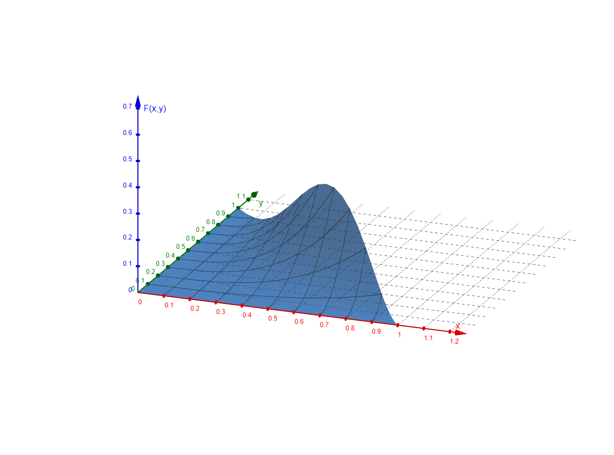

  
  ```{r global_options, include=FALSE}
knitr::opts_chunk$set(fig.height=3)

require(R330)

```
# Question 1
Based on the R code of the Monty Hall problem, and requiring essentially no alteration to simulate the Monty Crawl problem, it became apparent that they are one and the same in terms of the probabilities generated from optimal and sub optimal strategies. Specifically, it is best to switch to another door when offered the opportunity to, regardless of the number of the opened door, because to your knowledge it is still an arbitrary decision whether the smallest number is chosen, or if it is chosen randomly; the likelihoods don't change. As such, if following the optimal strategy (switching), the likelihood of winning the car is $0.66 \approx \frac{2}{3}$. The R code is located in the appendix as #1.

# Question 2
## a
\begin{align*}
&c \int_0^1 \int_0^{1-x} x^2y\;\: \mathrm{d}y\mathrm{d}x = 1\\
&= \frac{c}{2} \int_0^1 x^2 \left[y^2\right]_0^{1-x} \;\: \mathrm{d}x\\
&= \frac{c}{2} \int_0^1 x^2(1-x)^2\;\: \mathrm{d}x\\
&= \frac{c}{2} \int_0^1 x^4-2x^3+x^2\;\: \mathrm{d}x\\
&= \frac{c}{2} \left[\frac{x^5}{5}-\frac{x^4}{2}+\frac{x^3}{3}\right]_0^1\\
&= \frac{c}{2} \left(\frac{1}{5}-\frac{1}{2}+\frac{1}{3}\right)\\
&= \frac{c}{60} = 1\\
&\implies c = 60
\end{align*}

## b
\begin{align*}
F_{XY} (x,y) &= 60 \int_0^x \int_0^y u^2v \;\: \mathrm{d}v\mathrm{d}u\\
&= 30 \int_0^x \left[u^2v^2\right]_0^y \;\: \mathrm{d}u\\
&= 30 \int_0^x u^2y^2 \;\: \mathrm{d}u\\
&= 10 \left[u^3y^2\right]_0^x\\
&= \begin{cases}
    10x^3y^2     &\quad x+y<1, x > 0, y > 0\\
    0            &\quad \mathrm{otherwise}
\end{cases}\\
\end{align*}




## c
\begin{align*}
f_X(x) &= \int_{-\infty}^\infty f_{XY}(x,y) \;\: \mathrm{d}y\\
&= 60x^2 \int_0^{1-x} y \;\: \mathrm{d}y\\
&= 30x^2 \left[y^2\right]_0^{1-x}\\
&= \begin{cases}
    30x^2(1-x)^2 &\quad 0 < x < 1\\
    0            &\quad \mathrm{otherwise}
\end{cases}\\
\\
F_X(x) &= \int_{-\infty}^\infty f_X(u) \;\: \mathrm{d}u\\
&= \int_0^x 30u^2(1-u)^2 \;\: \mathrm{d}u\\
&= 30 \int_0^x u^4 - 2u^3 +u^2 \;\: \mathrm{d}u\\
&= 30 \left[\frac{u^5}{5}-\frac{u^4}{4}+\frac{u^3}{3}\right]_0^x\\
&= 30 \left[\frac{x^5}{5}-\frac{x^4}{4}+\frac{x^3}{3}\right]\\
&= \begin{cases}
    0                        &\quad x \leq 0\\
    6x^5 - 15x^4 +10x^3      &\quad 0 < x \leq 1\\
    1                        &\quad x > 1
\end{cases}\\
\\
f_Y(y) &= \int_{-\infty}^\infty f_{XY}(x,y) \;\: \mathrm{d}x\\
&= 60y \int_0^{1-y} x^2 \;\: \mathrm{d}x\\
&= 20y \left[x^3\right]_0^{1-y} \\
&= \begin{cases}
    20y(1-y)^3   &\quad 0 < y < 1\\
    0            &\quad \mathrm{otherwise}
\end{cases}\\
\\
F_Y(y) &= \int_{-\infty}^y f_Y(v) \;\: \mathrm{d}v\\
&= \int_0^y 20v(1-v)^3 \;\: \mathrm{d}v\\
&= 20 \int_0^y -v^4+3v^3-3v^2+v \;\: \mathrm{d}v\\
&= 20 \left[-\frac{v^5}{5}+\frac{3v^4}{4}-v^3+\frac{v^2}{2}\right]_0^y\\
&= 20 \left[-\frac{y^5}{5}+\frac{3y^4}{4}-y^3+\frac{y^2}{2}\right]\\
&= \begin{cases}
    0                               &\quad y \leq 0\\
    -4y^5 + 15y^4 - 20y^3 +10y^2    &\quad 0 < y \leq 1\\
    1                               &\quad y > 1
\end{cases}\\
\end{align*}

## d
\begin{align*}
E(X) &= \int_0^1 xf_X(x) \;\: \mathrm{d}x\\
&= \int_0^1 x30x^2(1-x)^2 \;\: \mathrm{d}x\\
&= 30 \int_0^1 x^5 - 2x^4 + x^3 \;\: \mathrm{d}x\\
&= 30 \left[\frac{x^6}{6}-\frac{2x^5}{5}+\frac{x^4}{4}\right]_0^1\\
&= \frac{1}{2}\\
\\
E(X^2) &= \int_0^1 x^2f_X(x) \;\: \mathrm{d}x\\
&= \int_0^1 x^2 30x^2(1-x)^2 \;\: \mathrm{d}x\\
&= 30 \int_0^1 x^6 - 2x^5 + x^4 \;\: \mathrm{d}x\\
&= 30 \left[\frac{x^7}{7}-\frac{x^6}{3}+\frac{x^5}{5}\right]_0^1\\
&= \frac{2}{7}\\
\\
Var(X) &= E(X^2) - \mu^2_X\\
&= \frac{2}{7}-\left(\frac{1}{2}\right)^2\\
&= \frac{1}{28}\\
\\
E(Y) &= \int_0^1 yf_Y(y) \;\: \mathrm{d}y\\
&= \int_0^1 y20y(1-y)^3 \;\: \mathrm{d}y\\
&= 20 \int_0^1 -y^5 + 3y^4 - 3y^3 +y^2 \;\: \mathrm{d}y\\
&= 20 \left[-\frac{y^6}{6}+\frac{3y^5}{5}-\frac{3y^4}{4}+\frac{y^3}{3}\right]_0^1\\
&= \frac{1}{3}\\
\end{align*}
\begin{align*}
E(Y^2) &= \int_0^1 y^2f_Y(y) \;\: \mathrm{d}y\\
&= \int_0^1 y^2 20y(1-y)^3 \;\: \mathrm{d}y\\
&= 20 \int_0^1 -y^6 + 3y^5 - 3y^4 +y^3 \;\: \mathrm{d}y\\
&= 20 \left[-\frac{y^7}{7}+\frac{y^6}{2}-\frac{3y^5}{5}+\frac{y^4}{4}\right]_0^1\\
&= \frac{1}{7}\\
\\
Var(Y) &= E(Y^2) - \mu^2_Y\\
&= \frac{1}{7}-\left(\frac{1}{3}\right)^2\\
&= \frac{2}{63}\\
\\
E(XY) &= \int_0^1 \int_0^{1-x} xy60x^2y\;\: \mathrm{d}y\mathrm{d}x\\
&= 60 \int_0^1 \int_0^{1-x} x^3y^2\;\: \mathrm{d}y\mathrm{d}x\\
&= 20 \int_0^1 x^3\left[y^3\right]_0^{1-x}\;\: \mathrm{d}x\\
&= 20 \int_0^1 x^3(1-x)^3\;\: \mathrm{d}x\\
&= 20 \int_0^1 -x^6 + 3x^5 - 3x^4 +x^3 \;\: \mathrm{d}x\\
&= 20 \left[-\frac{x^7}{7}+\frac{x^6}{2}-\frac{3x^5}{5}+\frac{x^4}{4}\right]_0^1\\
&= \frac{1}{7}\\
\\
Cov(X,Y) &= \sigma_{X,Y} = E(XY) - \mu_X\mu_Y\\
&= \frac{1}{7} - \frac{1}{2} \cdot \frac{1}{3}\\
&= -\frac{1}{42}\\
\\
\rho_{X,Y} &= \frac{Cov(X,Y)}{\sigma_X\sigma_Y}\\
&= \frac{-\frac{1}{42}}{\sqrt{\frac{1}{28}}\sqrt{\frac{2}{63}}}\\
&= -\frac{\sqrt{2}}{2} \approx -0.707
\end{align*}

## e
The covariance coefficient $\rho_{X,Y} = -\frac{\sqrt{2}}{2} \approx -0.707$, indicating a fairly strong negative correlation between X and Y. Therefore, they are not uncorrelated. A direct result of them being correlated is that they must not be independent, because if X and Y are independent, they must be uncorrelated. As they are _not_ uncorrelated, they are therefore not independent.

# Question 3
Based on simulation of 1,000,000 Markov Chains, the long run probability that the drunk man finds his way home before returning to the pub is $\approx$ 0.57. The R code for the simulation is located in the appendix as #3

# Question 4
Based on simulation of 1,000,000 Markov Chains, the long run expected time to get to safety is $\approx$ 6.0 hours. The R code for the simulation is located in the appendix as #4


# Appendix
## 1
```{r,echo=TRUE,eval=FALSE}
MontyCrawl <- function(n.games, change){
  #change = 1 for switch door, change = 0 to not switch door
  n.wins <- 0
  for (i in 1:n.games){
    car.behind.door <- sample(3,size=1)
    door.you.select.first <- sample(3,size=1)
    doors.available.to.host <- c(1,2,3)[-c(car.behind.door,door.you.select.first)]
    host.selects.door <- doors.available.to.host[1]
    if (change != 0){
      door.you.select.final <- c(1,2,3)[-c(host.selects.door,door.you.select.first)]
    } else {
      door.you.select.final <- door.you.select.first
    }
    if (door.you.select.final == car.behind.door){
      n.wins <- n.wins + 1
    }
  }
  return(n.wins/n.games)
}
```
\newpage
## 3
```{r,echo=TRUE,eval=FALSE}
library(Rlab)

PubChain <- function(N){
  total.home = 0
  for (i in 1:N){
    at.home <- FALSE
    at.pub <- FALSE
    step.net <- 0
    while(at.home == FALSE & at.pub == FALSE){
    # each step is a random variable with bernoulli distribution,\\
    # success (1) being forward, failure (0) being backward
      step <-  rbern(1,0.7)
      if (step == 1){
        step.net <- step.net + 1
        } else {
        step.net <- step.net - 1
        }
      if (step.net == 20){
        at.home <- TRUE
        total.home <- total.home + 1
      }
      if (step.net == -1){
        at.pub <- TRUE
      }
    }
  }
return (total.home/N)
}
```
\newpage
## 4
```{r,echo=TRUE,eval=FALSE}
library(Rlab)

MineChain <- function(N){
  times <- rep(NA,N)
  # times is a vector containing all the simulated times taken to get to safety
  for(i in 1:N){
    safe <- FALSE
    time <- 0
    while(safe == FALSE){
      door <- sample (3, size =1)
      if(door == 1){
        safe <- TRUE
        time <- time + 1
      }
      if(door == 2){
        time <- time + 2
      }
      if(door == 3){
        time <- time + 3
      }
    }
    times[i] <- time
  }
return (mean(times))
}
```