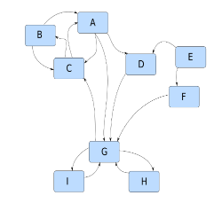

  
```{r global_options, include=FALSE}
knitr::opts_chunk$set(fig.height=3)

require(R330)

```

# Question 1
\textit{Show that for $$\pi_i = 2^{-N} \binom{N}{i}$$ for all $i$ in $[0,N]$, satisfes the equality $\pi = \pi\textbf{P}$, where \textbf{P} is the 1-step transition probability matrix for the Ehrenfest process with $N$ particles.}

The Ehrenfest process takes the form of a markov chain with transition probabilities given by:
$$P(X_t = j | X_{t-1} = i) =
  \begin{cases}
    \frac{i}{N}       & \quad  j = i-1\\
    1-\frac{i}{N}     & \quad  j = i+1\\
    0                 & \quad \text{otherwise}
  \end{cases}$$
  
This gives us the square matrix \textbf{P}, where
$$P = \begin{pmatrix}
      0 & 1-\frac{i}{N} & 0  & \cdots & 0\\
      \frac{i}{N} & 0 & 1-\frac{i}{N} & \ddots & \vdots\\
      0 & \frac{i}{N} & \ddots & \ddots & 0\\
      \vdots & \ddots & \ddots  & 0 & 1-\frac{i}{N}\\
      0 & \cdots & 0 & \frac{i}{N} & 0
      \end{pmatrix}$$
And we have
$$\vec{\pi} = \begin{pmatrix}
              2^{-N} & N2^{-N} & 2^{-N} \binom{N}{2} & 2^{-N} \binom{N}{3} & \cdots & 2^{-N} \binom{N}{N-2} &                  N2^{-N}  & 2^{-N} 
              \end{pmatrix}$$
              
Now, for the identity $\pi \textbf{P} = \pi$ to hold, we must have 3 cases for the matrix multiplication. We require that (for the end multiplications):
$$2^{-N} = N2^{-N} \cdot \frac{1}{N}$$
As well as
$$2^{-N} = N2^{-N}(1-\frac{N-1}{N})$$
Which are both trivial. Less trivially, we require the final identity to hold:
$$2^{-N} \binom{N}{i} = \left(1-\frac{i-1}{N}\right)\cdot2^{-N} \binom{N}{i-1} + \frac{i+1}{N}\cdot2^{-N} \binom{N}{i+1}$$
Which can be proven as follows:
\begin{align*}
&\left(1-\frac{i-1}{N}\right)\cdot2^{-N} \binom{N}{i-1} + \frac{i+1}{N}\cdot2^{-N}\\
&= 2^{-N} \left(\left(1-\frac{i-1}{N}\right)\cdot\binom{N}{i-1} + \frac{i+1}{N}\right)\\
&= 2^{-N} \left(\frac{N!}{(i-1)!(N-i+1)!} - \frac{(N-1)!}{(i-2)!(N-i+1)!} + \frac{(N-1)!}{i!(N-i-1)!}\right)\\
&= 2^{-N} \left(\frac{N!}{i!(N-i)!} \cdot \frac{i}{N-i+1} - \frac{N!}{i!(N-i)!} \cdot \frac{i(i-1)}{N(N-i+1)} + \frac{N!}{i!(N-i)!} \cdot \frac{N-i}{N}\right)\\
&= 2^{-N} \binom{N}{i} \left( \frac{i}{N-i+1} - \frac{i(i-1)}{N(N-i+1)} + \frac{N-i}{N} \right)\\
&= 2^{-N} \binom{N}{i} \left( \frac{Ni}{N(N-i+1)} - \frac{i(i-1)}{N(N-i+1)} + \frac{(N-i)(N-i+1)}{N(N-i+1)} \right)\\
&= 2^{-N} \binom{N}{i} \left( \frac{Ni - i(i-1) + (N-i)(N-i+1)}{N(N-i+1)} \right)\\ 
&= 2^{-N} \binom{N}{i} \left( \frac{N(N-i+1)}{N(N-i+1)} \right)\\ 
&= 2^{-N} \binom{N}{i}
\end{align*}

# Question 2
\textit{What is the variance of the time to fixation of a bi-allelic gene in a Wright-Fisher population given that the population size is $N = 100$ and the number of alleles of one type is originally equal to 50. You will describe your approach in plain English and write a computer program that simulates the evolution of the number of A alleles in a Wright-Fisher population (add the code of your program, with comments, in the appendix of your report).}

My approach will be to create a program simulating the evolution of the number of A alleles in a Wright-Fisher population, with parameters N=100 and A=50, then repeatedly run this program a large number of times, storing each result in a vector, where I will calculate it's variance. The program is given in the appendix as program 1. Upon several thousand simulations, it converges upon a variance of about 10250

# Question 3
\textit{A professor has 5 students. Each day, each of them sends her an email with probability 0.2 and independently of the other students. Each afternoon she checks her inbox and if there are more than five new emails she replies to all of them immediately. However, if there are five or less, she replies to all the emails with probability 1/3 and leaves them for the next day with probability 2/3. Consider the number of new emails in her inbox just before she checks it each day. Is it reasonable to model this as a Markov chain? If so, what is the state space and the 1-step transition probability matrix?}

It is reasonable to model this as a markov chain. In this case, the transition probabilities model events as $P(X_t = j | X_{t-1} = 1)$ = {Probability of j emails in inbox before checking today, given i emails in inbox before checking yesterday}.\newline
\newline
Let Y = the number of emails sent by students per day.\newline
Then Y ~ Bin(5,0.2), so $P(Y=y) = \binom{5}{y}0.2^y0.8^{5-y}$ \newline
\newline
As the inbox is cleared at above 5 emails every afternoon, and assuming only 5 emails can be sent a day, we have that the state space S = {0,1,2,...,9,10}. For all possible transitions there are 4 cases that need to be considered, shown in the code for the one step transition matrix below


```{r}
# 0 probability for anything other than the 4 options below
P <- matrix(rep(0,11^2),nrow=11)

for (i in 0:10){
  for (j in 0:10){
    if (i<=5 & j<i){
      P[i+1,j+1] <- (1/3)*dbinom(j,5,0.2)
    }
    if (i<=j & j<=5){
      P[i+1,j+1] <- (1/3)*dbinom(j,5,0.2) + (2/3)*dbinom(j-i,5,0.2)
    }
    if (i>5  & j<=5){
      P[i+1,j+1] <- dbinom(j,5,0.2)
    }
    if ((j>5) & (i<=5) & (j<=(5+i))){
      P[i+1,j+1] <- (2/3)*dbinom(j-i,5,0.2)
    }
  }
}
P
rowSums(P)

```

# Question 4
\textit{Write a computer program that calculates the PageRank score for the graph below. You will provide a brief outline of the method and discuss the results obtained (e.g., do you think the ranking provided by the algorithm is relevant or not). You will also describe way(s) to "cheat" the PageRank algorithm, i.e., how can you make sure a given page receives a high score (assuming you have freedom to create new pages).}
\newline

\newline

To calculate the pagerank score, I created first a function that will take the adjacency matrix of the graph and convert it to an M matrix utilised by the PageRank algorithm (function GetM). This is then fed into the function that calculates the PageRank (GetS). It follows the regular form, with $\alpha = 0.85$ and as v can be any arbitrary vector, v is initially set equal to z. It is then iterated as specified in class, until it reaches a sufficiently close equivalency of 5E-7. The output vector S gives the long-run probabilities of each element corresponding to it's equivalent node (Here, A = 1, B = 2, etc.) The program and it's output are entitled Program 2 in the appendix. It's output is as expected, given the original graph. G is ranked the highest, with the most links, E the lowest, with no links, and C ranked far higher than D due to the extra boost a link from G gives. The most obvious way to cheat the algorithm is to make a massive number of new pages, and have them link to the page you want boosted in the rankings.


\newpage
# Appendix

## Program 1
```{r}
# This gives fixation time for A allele
FixationTime <- function (A = 50, N = 100){   
  time <- 0
  # Loop forms new generations until fixation
  while (A != 0 & A != N){
    time <- time + 1
    A <- rbinom(1,N,(A/N))
  }
  # Returns time to fixation
  return (time)
}

# This gives fixation variance from large number of simulations
FixVar <- function(M=10000){
  times <- rep(NA,M)
  # Fills in the vector with each entry being a simulated fixation time
  for (i in 1:M){
    times[i] <- FixationTime()
  }
  # returns variance of the vector
  return (var(times))
}
```
\newpage
## Program 2
```{r}
#adjacency matrix of Question 4 graph
mat <- matrix(c(0,0,1,1,0,0,1,0,0,
                1,0,1,0,0,0,0,0,0,
                1,1,0,0,0,0,0,0,0,
                0,0,0,0,0,0,1,0,0,
                0,0,0,1,0,1,0,0,0,
                0,0,0,0,0,0,1,0,0,
                0,0,1,0,0,0,0,1,1,
                0,0,0,0,0,0,1,0,0,
                0,0,0,0,0,0,1,0,0),nrow=9,byrow=TRUE)

GetM <- function (M){
  size.M <- nrow(M)
  distscores <- rep(NA,size.M)
  for (i in 1:size.M){
    distscores[i] <- 1/sum(M[i,])
  }
  for (i in 1:size.M){
    for (j in 1:size.M){
      if (M[i,j] == 1){
        M[i,j] <- distscores[i]
      }
    }
  }
  return (M)
}

GetS <- function(M){
  size.M <- nrow(M)
  alpha <- 0.85
  Z <- rep(1/size.M, size.M)
  v <- Z
  vP <- alpha*v%*%M + (1-alpha)*Z
  curr = c(rep(0,size.M))
  for (i in 1:size.M){
    while (vP[i] - curr[i] > 0.0000005){
      curr <- vP
      vP <- alpha*vP%*%M + (1-alpha)*Z
    }
  }
  return(vP)
}

GetS(GetM(mat))
```
